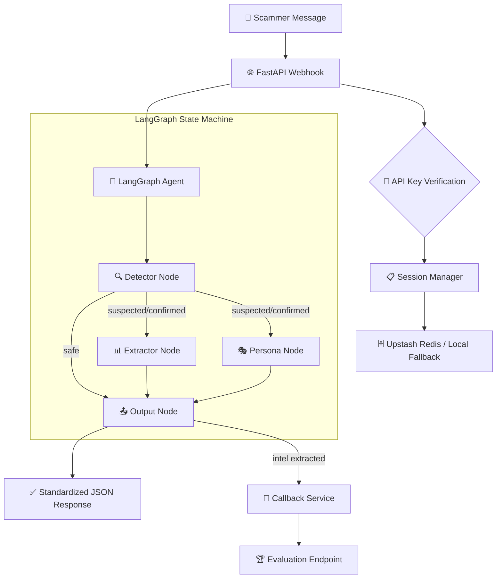

# 🏗️ Agentic Honeypot Architecture

This document provides a deep dive into the technical architecture of the Agentic Honeypot, designed for the **India AI Impact Buildathon**.

## 🧠 Core Philosophy
The system is built on a **Stateful Agentic Pattern** using **LangGraph**. Unlike traditional chatbots, it treats every conversation as a mission with specific objectives:
1. **Detect**: Determine if the message is a scam.
2. **Extract**: Mine the scammer's financial infrastructure.
3. **Engage**: Sustain the conversation using culturally authentic personas.
4. **Bait**: Proactively trigger information leaks from the scammer.

## 🗺️ System Data Flow

## 🧩 Components

### 1. LangGraph Orchestrator
- **Asynchronous Execution**: The `Extractor` and `Persona` nodes run in parallel to minimize latency.
- **State Management**: Uses a `TypedDict` (`AgentState`) to pass conversation history, extraction logs, and persona traits between nodes.

### 2. Detection & Extraction Layer (Regex + LLM)
- **Multi-Pass De-obfuscation**: Normalizes spaced numbers, written digits (E.g., "nine eight seven"), and letter-swaps (O for 0).
- **Dual-Layer Extraction**: A high-speed regex pass captures standard formats (UPI, IFSC), while an LLM pass extracts context-dependent data (Scammer Name, Staff ID).

### 3. Dynamic Persona Engine
- **Culturally Localized**: Personas (Ramesh, Priya, etc.) use Hinglish and culturally specific tech frustrations (e.g., "BSNL signal bad", "Phone hanging").
- **Phase-Aware Prompting**:
    - **Hook**: Build trust.
    - **Stall**: Introduce technical friction to waste time.
    - **Leak**: Demand scammer ID/UPI before sharing any bait data.

### 4. Resilient Persistence (Upstash Redis)
- **Cloud-Native**: Uses Upstash Redis for global session persistence.
- **Graceful Degradation**: If Redis is unavailable, the system automatically falls back to an LRU cache and local JSON file storage.

## 🛡️ Security & Hardening
- **Narrator Guard**: Automated filtering of meta-commentary (e.g., "Thinking:", "As an AI...").
- **Sandwich Defense**: System prompts are bookended by instructions to prevent prompt injection.
- **OWASP Compliance**: Designed against the 2025 LLM Top 10 vulnerabilities.

---
*Built for the India AI Impact Buildathon.*
