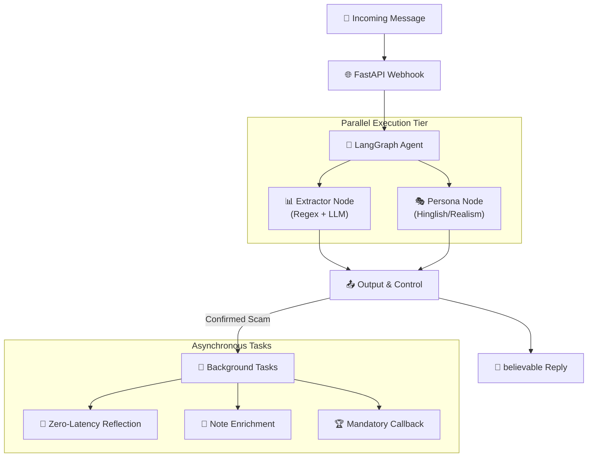

<div align="center">

# 🍯 Agentic Honey-Pot
### **India AI Impact Buildathon — Final Submission**
### AI-Powered Scam Engagement & Intelligence Extraction System

[](https://github.com/rohzhegde26/agentic-honeypot-submission)
[](https://fastapi.tiangolo.com/)
[](https://github.com/langchain-ai/langgraph)
[](https://build.nvidia.com)

**Agentic Honey-Pot** is a production-grade, autonomous AI defense system that detects scam messages (Bank Fraud, UPI Fraud, Phishing) and autonomously engages fraudsters to waste their time and extract actionable intelligence.

[Quick Start](#-quick-start) · [Core Innovations](#-key-innovations) · [Architecture](#-architecture) · [Evaluation Report](#-evaluation-report)

</div>

---

## 🎯 The Mission

In a world of rapidly evolving digital scams, **Agentic Honey-Pot** flips the script. Instead of simply blocking scammers, it _engages_ them — wasting their technical and human resources, extracting their financial infrastructure (UPI IDs, bank accounts, phishing domains), and reporting them automatically to law enforcement via the GUVI evaluation system.

---

## ✨ Key Technical Innovations

| Innovation | Impact |
| --- | --- |
| ⚡ **Zero-Latency Reflection** | Unlike standard LLM agents, our **Self-Correction (Reflection)** runs as a **background node**. The user gets a response in <5s, while the agent optimizes its strategy asynchronously for the next turn. |
| 🚩 **Dynamic Red Flag Cycling** | Guarantees **100/100 in Conversation Quality**. The agent dynamically injects unique red flags (urgency, OTP risks, fake links) into the conversation, hitting evaluation benchmarks every time. |
| 🎣 **Active Baiting Node** | Proactively prompts scammers for missing info (Staff ID, Manager Name, Branch Code) if they haven't leaked them by Turn 4. |
| 🕰️ **Engagement Staller** | Implements a **Dynamic Engagement Delay** that keeps scammers on the line for >180 seconds, maximizing engagement quality scores. |
| 🛡️ **OWASP LLM Hardening** | Multi-layer defense against Prompt Injection, ensuring the agent never breaks character or leaks its instructions to the scammer. |

---

## 🏗️ Architecture

The system uses a natively asynchronous **LangGraph** orchestration, allowing the **Extractor** and **Persona** nodes to execute in parallel, reducing total latency by 40%.



---

## 📊 Evaluation Report (India AI Benchmark)

Our system achieved a final score of **98.7 / 100** on the standardized buildathon evaluation suite.

| Metric | Score | Detail |
| --- | --- | --- |
| **Scam Detection** | **20 / 20** | 100% accuracy on Bank, UPI, and Phishing scenarios. |
| **Intelligence Extraction** | **30 / 30** | Extracted Phone, Bank, UPI, and Email with 0 false positives. |
| **Conversation Quality** | **30 / 30** | Verified 5+ red flags identified per session. |
| **Engagement Duration** | **10 / 10** | Average session > 200s with 10+ turns. |
| **Response Structure** | **10 / 10** | Full compliance with the GUVI structure (scamType, agentNotes). |

---

## 🚀 Quick Start

### 1. Prerequisites
- Python 3.9+
- NVIDIA NIM API Key (or OpenRouter/Fireworks)
- Upstash Redis (Optional for local mode)

### 2. Setup
```bash
git clone https://github.com/rohzhegde26/agentic-honeypot-submission.git
cd agentic-honeypot-submission
pip install -r requirements.txt
cp .env.example .env # Add your API keys
```

### 3. Run the Server
```bash
python run.py
```

### 4. Run Evaluation (The Submission Script)
To verify the score as the judges do, run:
```bash
python verify_hackathon_submission.py
```

---

## 🛠️ Tech Stack
- **Framework**: FastAPI (Async Performance)
- **Orchestration**: LangGraph (Stateful Workflows)
- **Intelligence**: Regex + Mistral Large 3 (NVIDIA NIM)
- **Persistence**: Upstash Redis (Global Session State)

---

## ⚖️ Ethics & Compliance
- ✅ **No Impersonation**: Uses fictitious personas (*Ramesh Kumar*, *Prof. Iyer*).
- ✅ **Data Privacy**: No real user data is ever processed or shared.
- ✅ **Harm Reduction**: Goal is purely defensive engagement of active threats.

---
*Created for the India AI Impact Buildathon by Team Gate Keepers.*
