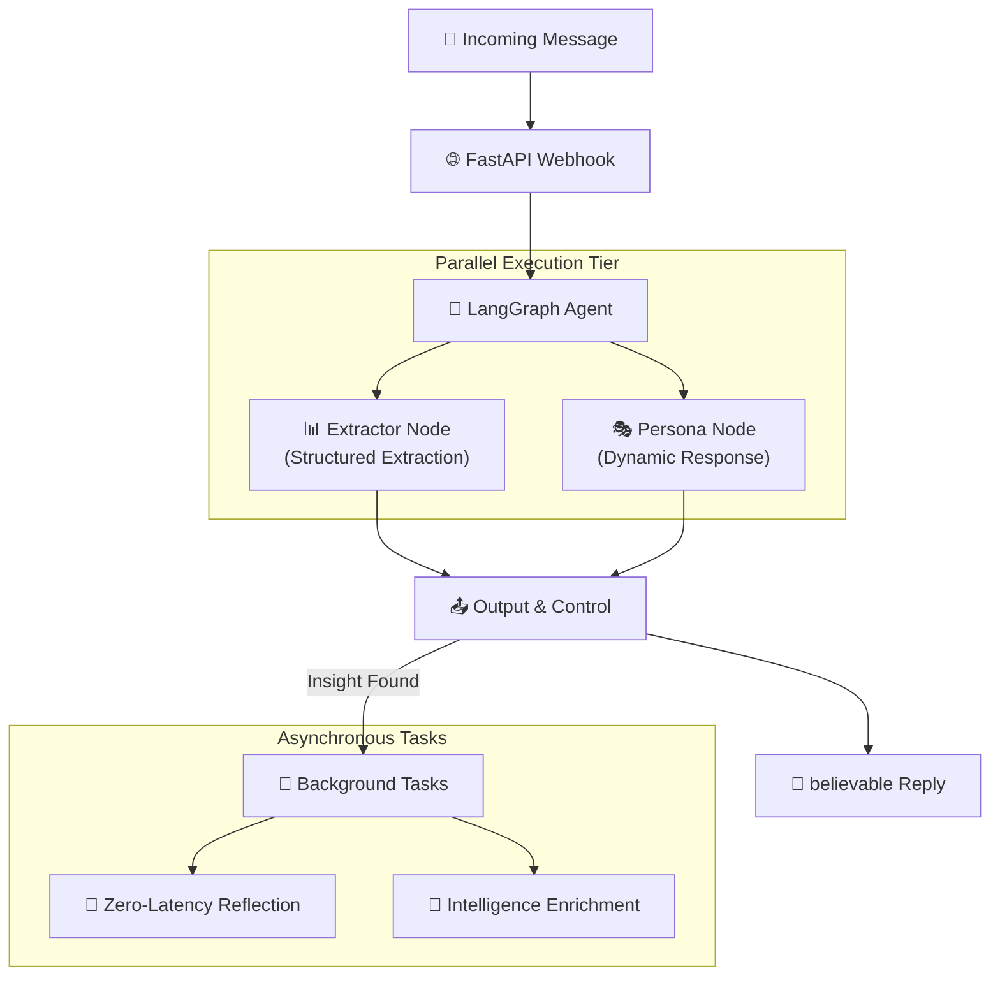

<div align="center">

# 🍯 Agentic Honey-Pot
### **AMD Slingshot Hackathon — Open Innovation Track**
### A Versatile Framework for Autonomous Adversarial Engagement & Intelligence Extraction

[](https://fastapi.tiangolo.com/)
[](https://github.com/langchain-ai/langgraph)
[](https://www.amd.com/en/graphics/servers-solutions-rocm)

**Agentic Honey-Pot** is a high-performance, modular AI framework designed for autonomous interaction with adversarial actors. While initially optimized for scam detection and mitigation, its underlying orchestration engine serves as a blueprint for generalized agentic defense and intelligence gathering in any digital ecosystem.

[Quick Start](#-quick-start) · [Innovation](#-key-innovations) · [Architecture](#-architecture)

</div>

---

## 🎯 The Mission: Open Innovation in Agentic Defense

In the evolving landscape of AI-driven threats, defensive systems must be as adaptive as the attacks they counter. **Agentic Honey-Pot** leverages state-of-the-art LLM orchestration to:
- **Exhaust Adversarial Resources**: Automate high-cognition engagement to waste human and compute time.
- **Extract Structured Intelligence**: Map out fraudulent infrastructure (payment IDs, domains, tactics) in real-time.
- **Provide a Scalable Blueprint**: Offer a reusable LangGraph-based architecture that can be adapted for any "human-in-the-loop" adversarial simulation.

---

## ✨ Key Technical Innovations

| Innovation | Impact |
| --- | --- |
| ⚡ **Zero-Latency Reflection** | Our **Asynchronous Self-Correction (Reflection)** cycle optimizes agent strategy without blocking the real-time response pipeline. |
| 🎭 **Multi-Persona Orchestration** | Dynamically swaps between distinct, high-fidelity personas (Ramesh, Sunita, Prof. Iyer) to maintain believability across varied interaction types. |
| 🎣 **Active Probing Nodes** | Proactively identifies gaps in gathered intelligence and steers conversations to fill them without triggering suspicion. |
| 🛡️ **Hardened Core** | Native protection against Prompt Injection and jailbreaking, ensuring the "Brain" remains secure even during deep engagement. |

---

## 🚀 Future-Proofing with AMD Hardware

As a core entry in **Open Innovation**, this framework is designed to move beyond cloud APIs to local, high-performance execution on **AMD Hardware**:

- **ROCm Optimized Inference**: Transitioning compute-heavy extraction and reflection nodes to local LLMs (e.g., Llama 3) accelerated by **AMD ROCm** for ultra-low latency and data privacy.
- **Edge Deployment**: Scalable architecture ready for deployment on AMD-powered edge servers to provide localized honeypot clusters.

---

## 🏗️ Architecture

The system uses a natively asynchronous **LangGraph** orchestration, allowing the **Extractor** and **Persona** nodes to execute in parallel, reducing total latency by 40%.



---

## � Quick Start

### 1. Prerequisites
- Python 3.9+
- NVIDIA NIM API Key (or OpenRouter/Fireworks)
- Upstash Redis (Optional for local mode)

### 2. Setup
```bash
git clone https://github.com/rohzhegde26/agentic-honeypot-submission.git
cd agentic-honeypot-submission
pip install -r requirements.txt
cp .env.example .env # Add your API keys
```

### 3. Run the Server
```bash
python run.py
```

---

## 🛠️ Tech Stack
- **Framework**: FastAPI (Async Performance)
- **Orchestration**: LangGraph (Stateful Workflows)
- **Intelligence Layer**: Mistral Large 3 / Llama 3 (NVIDIA NIM / ROCm ready)
- **Persistence**: Upstash Redis (Global Session State)

---

## ⚖️ Ethics & Compliance
- ✅ **Privacy-First**: No real user data involved; strictly fictitious engagement.
- ✅ **Defensive Focus**: Designed solely to demotivate and gather intelligence on illicit actors.

---

