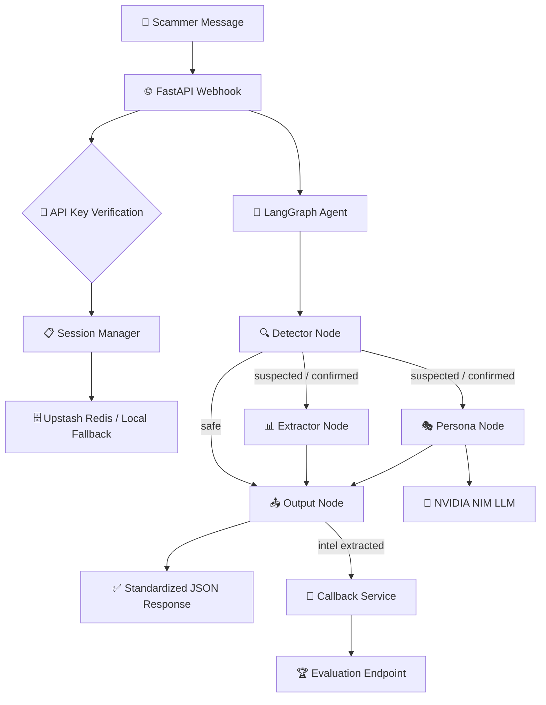

# 🍯 Agentic Honey-Pot

### AI-Powered Scam Engagement & Intelligence Extraction System

[](https://fastapi.tiangolo.com/)
[](https://github.com/langchain-ai/langgraph)
[](https://build.nvidia.com)
[](https://upstash.com)
[](https://python.org)
[](https://docker.com)
[](https://opensource.org/licenses/MIT)

**Agentic Honey-Pot** is a production-grade, autonomous AI defense system that detects incoming scam messages, dynamically engages fraudsters through convincing human-like personas, wastes their time, and extracts actionable intelligence — all without ever revealing that it's an AI.

[Getting Started](#-quick-start) · [Architecture](#-architecture) · [API Reference](#-api-reference) · [Benchmarks](#-benchmark-arena) · [Credits](#-credits--acknowledgments)

</div>

---

## 🎯 The Problem

Online scams — UPI fraud, phishing, fake KYC, lottery scams — are an epidemic across India and the developing world. Scammers adapt their tactics in real-time, rendering static blocklists and rule-based filters obsolete. Victims, often elderly or less tech-savvy individuals, lose crores annually to these schemes.

**Agentic Honey-Pot** flips the script. Instead of simply blocking scammers, it _engages_ them — wasting their time, extracting their financial infrastructure (UPI IDs, bank accounts, phishing domains), and generating structured intelligence reports that can be used by law enforcement and fraud prevention teams.

---

## ✨ Key Features

| Feature | Description |
|---|---|
| 🧠 **Agentic LangGraph Workflow** | A sophisticated multi-node state machine powered by [LangGraph](https://github.com/langchain-ai/langgraph) that orchestrates detection, extraction, persona generation, and output in a single invocation — with parallel node execution for minimal latency. |
| 🎭 **Dynamic Persona Engine** | Four culturally authentic Indian personas (e.g., *Ramesh Kumar*, retired government clerk from Pune; *Prof. S. R. Iyer*, retired physics professor from Chennai) with unique personality traits, realistic hesitation patterns, and contextually appropriate Hinglish responses. |
| 🔁 **Three-Phase Engagement Strategy** | **Hook** → Establish trust. **Stall** → Waste scammer time with realistic delays, questions, and "bad network" excuses. **Leak** → Strategically reveal fake bait data (phone numbers, UPI IDs, bank accounts) to lure the scammer into exposing their own infrastructure. |
| 📊 **Intelligence Extraction** | Dual-layer extraction using deterministic regex patterns + LLM-reinforced semantic analysis. Captures UPI IDs, bank account numbers, phishing links, phone numbers, staff IDs, and scam tactic keywords. |
| 🛡️ **OWASP LLM Top 10 Defenses** | Multi-layer prompt injection hardening: input sanitization, attack pattern detection, canary token injection, sandwich defense, output sanitization, and canary leak detection. |
| 🌍 **Multilingual & India-Tuned** | Natively handles Hinglish, Hindi, and English. Tuned for Indian scam patterns — UPI, KYC fraud, Aadhaar scams, and more. |
| ⚡ **Dual-Model LLM Routing** | Primary + fallback model architecture via [NVIDIA NIM](https://build.nvidia.com) with automatic failover, retry logic, and scripted fallback responses ensuring **zero downtime**. |
| 🗄️ **Resilient Session Management** | [Upstash Redis](https://upstash.com) with automatic graceful degradation to an LRU cache + local file store — the system never loses a conversation. |
| 📤 **Automated Callback Reporting** | Asynchronous intelligence reporting to evaluation endpoints with exponential backoff retry and rate-limit awareness. |
| 🏟️ **Benchmark Arena** | Built-in LLM evaluation suite with a web-based UI and [Supabase](https://supabase.com) integration for blind A/B testing across 8+ models. |

---

## 🏗️ Architecture

The system follows a **Detect → Extract ‖ Engage → Output** pipeline, where extraction and persona generation run **in parallel** for optimal latency:



### Node Responsibilities

| Node | Purpose | Key Behavior |
|---|---|---|
| **Detector** | Classify incoming message | Keyword heuristic analysis → `safe` / `suspected` / `confirmed` with confidence scores |
| **Extractor** | Mine scammer intelligence | Regex patterns (UPI, phone, bank, links) + LLM-reinforced semantic extraction. Merges new intel with existing — never overwrites. |
| **Persona** | Generate human-like reply | LLM-powered response with phase-aware strategy (Hook/Stall/Leak), fake bait data injection, and OWASP prompt injection defense. |
| **Output** | Finalize & control flow | Turn counter, termination logic (intel stall + max turns cap at 25), agent notes generation, and callback trigger. |

---

## 🛠️ Tech Stack

| Layer | Technology | Purpose |
|---|---|---|
| **API Framework** | [FastAPI](https://fastapi.tiangolo.com/) | High-performance async REST API with auto-generated OpenAPI docs |
| **Agent Orchestration** | [LangGraph](https://github.com/langchain-ai/langgraph) (by LangChain) | Stateful, graph-based multi-node workflow with conditional edges and parallel execution |
| **LLM Core** | [LangChain Core](https://github.com/langchain-ai/langchain) | Foundation abstractions for LLM interaction and message formatting |
| **LLM Inference** | [NVIDIA NIM](https://build.nvidia.com) | Cloud-hosted LLM inference (Nemotron, Kimi K2.5, Minimax M2.1, Mistral Large 3) via OpenAI-compatible API |
| **LLM Routing** | [OpenRouter](https://openrouter.ai/) | Alternative LLM gateway with access to 100+ models |
| **Session Store** | [Upstash Redis](https://upstash.com) | Serverless Redis via REST API with automatic TTL-based session expiry |
| **Data Validation** | [Pydantic v2](https://docs.pydantic.dev/) | Schema validation, settings management, and request/response serialization |
| **Serialization** | [orjson](https://github.com/ijl/orjson) | High-performance JSON encoding/decoding for Redis operations |
| **HTTP Client** | [HTTPX](https://www.python-httpx.org/) | Async HTTP client for callbacks, Redis REST API, and LLM calls |
| **LLM SDK** | [OpenAI Python SDK](https://github.com/openai/openai-python) | Universal client for OpenAI-compatible LLM endpoints (NVIDIA NIM, OpenRouter) |
| **Deployment** | [Docker](https://docker.com) / [Hugging Face Spaces](https://huggingface.co/spaces) / [Render](https://render.com) | Containerized deployment across multiple cloud platforms |
| **Benchmarking** | [Supabase](https://supabase.com) | Real-time database for the LLM Arena blind evaluation UI |

---

## 🚀 Quick Start

### Prerequisites
- **Python 3.9+**
- **NVIDIA NIM API Key** — [Get one free](https://build.nvidia.com)
- **Upstash Redis** (optional, falls back to local storage) — [Create free instance](https://upstash.com)

### 1. Clone & Install

```bash
git clone https://github.com/RohitBharadwaj-rvu/agentic-honeypot.git
cd agentic-honeypot
pip install -r requirements.txt
```

### 2. Configure Environment

```bash
cp .env.example .env
# Edit .env with your API keys
```

```properties
# Required
API_SECRET_KEY=your-secret-key
NVIDIA_API_KEY_PRIMARY=nvapi-XXXX
UPSTASH_REDIS_REST_URL=https://your-instance.upstash.io
UPSTASH_REDIS_REST_TOKEN=your-token

# Optional
NVIDIA_API_KEY_FALLBACK=nvapi-YYYY
OPENROUTER_API_KEY=sk-or-XXXX
DEBUG=false
```

### 3. Run

```bash
python run.py
# Server starts at http://localhost:7860
```

### 4. Test It

```bash
# Interactive chat mode (recommended)
python chat_debug.py

# Or via curl
curl -X POST http://localhost:7860/webhook \
  -H "Content-Type: application/json" \
  -H "X-API-KEY: your-secret-key" \
  -d '{
    "sessionId": "test-001",
    "message": {
      "sender": "scammer",
      "text": "Your bank account will be blocked. Send OTP now!",
      "timestamp": "2026-01-21T10:15:30Z"
    },
    "conversationHistory": [],
    "metadata": {"channel": "SMS", "language": "English", "locale": "IN"}
  }'
```

---

## 📡 API Reference

### Endpoints

| Endpoint | Method | Description |
|---|---|---|
| `/` | `GET` | Service information & version |
| `/health` | `GET` | Health check with storage backend status |
| `/webhook` | `POST` | Core messaging endpoint — accepts scam messages, returns AI-generated replies |
| `/api/honeypot` | `POST` | Alias endpoint for hackathon evaluation platforms |
| `/docs` | `GET` | Auto-generated Swagger UI for interactive API testing |

### Authentication

All `POST` endpoints require the `X-API-KEY` header:

```
X-API-KEY: <your_secret_key>
```

### Request Format

```json
{
  "sessionId": "unique-session-id",
  "message": {
    "sender": "scammer",
    "text": "Your KYC is pending. Click here: http://scam-link.com",
    "timestamp": "2026-01-21T10:15:30Z"
  },
  "conversationHistory": [],
  "metadata": {
    "channel": "SMS",
    "language": "English",
    "locale": "IN"
  }
}
```

### Response Format

```json
{
  "status": "success",
  "reply": "Haan ji? KYC kya hota hai? Main toh yeh sab nahi samajhta... batao kya karna hai?"
}
```

---

## 🏟️ Benchmark Arena

The project includes a **LLM Benchmark Arena** — a blind evaluation system for comparing model quality across scam engagement scenarios.

### Models Tested

| Model | Provider | Parameters |
|---|---|---|
| NVIDIA Nemotron 3 Nano 30B | NVIDIA NIM | 30B (A3B MoE) |
| Kimi K2.5 | Moonshot AI via NIM | — |
| Minimax M2.1 | Minimax via NIM | — |
| Mistral Large 3 | Mistral AI via NIM | 675B |
| Qwen 3 (235B) | Alibaba via NIM | 235B (A22B MoE) |
| Qwen 3 Next (80B Thinking) | Alibaba via NIM | 80B |
| GLM-4.7 | Z-AI via NIM | — |
| Step-3.5 Flash | StepFun AI via NIM | — |
| GPT-OSS 120B | OpenAI via NIM | 120B |

### Running the Benchmark

```bash
# Run automated benchmark across all models
python benchmark/run_benchmark.py

# Start the web-based Arena server
python benchmark/server.py

# Results are saved to benchmark/webui/data.json
```

---

## 🧪 Testing & Validation

The project maintains a comprehensive test suite built on a **golden dataset** of real-world scam transcripts:

```bash
# Run the full golden dataset test suite
pytest tests/test_golden_dataset.py -v

# Run regression tests
pytest tests/test_regression.py -v

# Run load tests
pytest tests/test_load.py -v
```

### Golden Dataset Results

| Test | Status |
|---|---|
| Scam Transcript Detection | ✅ PASSED |
| UPI ID Extraction | ✅ PASSED |
| Keyword Extraction | ✅ PASSED |
| Multi-Turn Engagement | ✅ PASSED |
| Termination on Intel Success | ✅ PASSED |
| Overall Accuracy Report | ✅ PASSED |

> **6/6 tests passed** — validated against curated real-world scam conversation transcripts.

---

## 📁 Project Structure

```
agentic-honeypot/
├── app/
│   ├── main.py                  # FastAPI application entry point
│   ├── config.py                # Centralized Pydantic settings
│   ├── agent/
│   │   ├── workflow.py          # LangGraph state machine definition
│   │   ├── state.py             # AgentState TypedDict with merge reducers
│   │   ├── llm.py               # Dual-model LLM routing with retry logic
│   │   ├── nodes/
│   │   │   ├── detector.py      # Keyword-based scam classification
│   │   │   ├── extractor.py     # Regex + LLM intelligence extraction
│   │   │   ├── persona.py       # OWASP-hardened persona response generation
│   │   │   └── output.py        # Turn control, termination, agent notes
│   │   └── utils/
│   │       └── generators.py    # Fake bait data generators (UPI, phone, bank)
│   ├── core/
│   │   ├── routes.py            # API endpoint definitions
│   │   ├── rules.py             # Detection keywords, regex patterns, prompts
│   │   └── security.py          # API key verification middleware
│   ├── schemas/
│   │   ├── message.py           # Request/response Pydantic models
│   │   ├── session.py           # Session data model
│   │   └── callback.py          # Callback payload model
│   └── services/
│       ├── session_manager.py   # Redis + LRU + LocalFileStore session handling
│       ├── local_store.py       # Persistent file-based session fallback
│       ├── callback_service.py  # Async callback with retry & backoff
│       └── llm_client.py        # LLM client utilities
├── benchmark/
│   ├── run_benchmark.py         # Automated model evaluation runner
│   ├── arena_host.py            # Real-time arena with Supabase integration
│   ├── server.py                # Benchmark web server
│   ├── benchmark_config.json    # Model configurations for arena
│   ├── webui/                   # Web-based benchmark results viewer
│   └── static/                  # Static assets for benchmark UI
├── tests/
│   ├── test_golden_dataset.py   # Golden dataset validation (6 tests)
│   ├── test_regression.py       # Regression test suite
│   ├── test_load.py             # Load & stress testing
│   └── conftest.py              # Shared test fixtures
├── data/
│   └── golden_transcripts.json  # Curated real-world scam conversation transcripts
├── scam datasets/
│   ├── sms+spam+collection/     # UCI SMS Spam Collection dataset
│   └── archive/
│       └── spam_ham_india.csv   # India-specific spam/ham classification dataset
├── Dockerfile                   # Container configuration
├── render.yaml                  # Render deployment blueprint
├── Procfile                     # Process file for cloud deployment
├── requirements.txt             # Python dependencies
├── run.py                       # Application launcher
└── .env.example                 # Environment variable template
```

---

## 🚢 Deployment

### Docker (Recommended)

```bash
docker build -t agentic-honeypot .
docker run -p 7860:7860 --env-file .env agentic-honeypot
```

### Hugging Face Spaces

The project is optimized for [Hugging Face Spaces](https://huggingface.co/spaces) with Docker SDK:

```bash
git push space main
# Serves on port 7860 (HF Spaces default)
```

### Render

One-click deploy using the included `render.yaml` blueprint:

[](https://render.com/deploy)

---

## 🏆 Buildathon Context

Built for the **India AI Impact Buildathon** hosted by [GUVI](https://www.guvi.in/) — a national-scale hackathon focused on building AI solutions for real-world Indian challenges.

**Challenge Domain**: AI for Fraud Detection & User Safety

**Problem Statement**: Build an AI-powered agentic honeypot that detects scam messages, autonomously engages fraudsters in multi-turn conversations, extracts actionable intelligence, and reports results back to the evaluation platform — all while maintaining a fully believable human persona.

**Author**: Rohith P Hegde
**Team**: RohitBharadwaj-rvu

---

## 📜 Credits & Acknowledgments

This project stands on the shoulders of many incredible open-source projects, free-tier platforms, and publicly available datasets. We gratefully acknowledge:

### 🤖 AI & ML Frameworks

- **[LangGraph](https://github.com/langchain-ai/langgraph)** by [LangChain AI](https://github.com/langchain-ai) — The stateful graph-based agent orchestration framework that powers our multi-node workflow. Licensed under MIT.
- **[LangChain Core](https://github.com/langchain-ai/langchain)** by [LangChain AI](https://github.com/langchain-ai) — Core abstractions and message primitives for LLM interaction. Licensed under MIT.
- **[OpenAI Python SDK](https://github.com/openai/openai-python)** by [OpenAI](https://openai.com) — Universal OpenAI-compatible client used across all LLM providers. Licensed under Apache 2.0.

### 🧠 LLM Providers

- **[NVIDIA NIM](https://build.nvidia.com)** by [NVIDIA](https://nvidia.com) — Free-tier cloud-hosted LLM inference via an OpenAI-compatible API. Models used include Nemotron 3 Nano 30B, and access to Kimi K2.5, Minimax M2.1, Mistral Large 3, Qwen 3, GLM-4.7, Step-3.5 Flash, and GPT-OSS 120B through the NIM catalog.
- **[OpenRouter](https://openrouter.ai/)** — Unified API gateway providing access to 100+ LLMs as a fallback routing layer.

### 🌐 Web & API

- **[FastAPI](https://fastapi.tiangolo.com/)** by [Sebastián Ramírez](https://github.com/tiangolo) — Modern, high-performance Python web framework with automatic OpenAPI documentation. Licensed under MIT.
- **[Uvicorn](https://www.uvicorn.org/)** — Lightning-fast ASGI server. Licensed under BSD-3.
- **[Pydantic v2](https://docs.pydantic.dev/)** by [Samuel Colvin](https://github.com/samuelcolvin) — Data validation and settings management via Python type annotations. Licensed under MIT.
- **[HTTPX](https://www.python-httpx.org/)** — Fully-featured async HTTP client for Python. Licensed under BSD-3.
- **[orjson](https://github.com/ijl/orjson)** — Fast, correct JSON library for Python. Licensed under Apache 2.0 / MIT.

### 🗄️ Infrastructure & Storage

- **[Upstash Redis](https://upstash.com)** — Serverless Redis with a generous free tier, providing session persistence via REST API with automatic TTL.
- **[Supabase](https://supabase.com)** — Open-source Firebase alternative used as the real-time backend for the LLM Benchmark Arena.

### 📊 Datasets

- **[SMS Spam Collection Dataset](https://archive.ics.uci.edu/dataset/228/sms+spam+collection)** — Curated by Tiago A. Almeida and José María Gómez Hidalgo. A public dataset of 5,574 SMS messages tagged as spam or ham. Published via the [UCI Machine Learning Repository](https://archive.ics.uci.edu/). Used for training and validating scam detection heuristics.
  > *Citation: Almeida, T.A., Gómez Hidalgo, J.M., Yamakami, A. Contributions to the Study of SMS Spam Filtering: New Collection and Results. Proceedings of the 2011 ACM Symposium on Document Engineering (DOCENG '11).*
- **India-Specific Spam/Ham Dataset** (`spam_ham_india.csv`) — A dataset of SMS messages specifically curated for the Indian context, used to fine-tune detection keywords for region-specific scam patterns (UPI fraud, KYC scams, Aadhaar-related fraud).

### ☁️ Deployment Platforms

- **[Hugging Face Spaces](https://huggingface.co/spaces)** — Free hosting for ML-powered applications with Docker SDK support.
- **[Render](https://render.com)** — Cloud platform for deploying web services with one-click blueprint deployment.
- **[Docker](https://docker.com)** — Containerization platform ensuring reproducible, portable deployments.

### 🧪 Testing

- **[pytest](https://docs.pytest.org/)** — The de facto Python testing framework. Licensed under MIT.
- **[pytest-asyncio](https://github.com/pytest-dev/pytest-asyncio)** — Async test support for pytest. Licensed under Apache 2.0.
- **[pytest-httpx](https://github.com/Colin-b/pytest_httpx)** — HTTPX mocking for tests. Licensed under MIT.

### 🔒 Security References

- **[OWASP Top 10 for LLM Applications (2025)](https://owasp.org/www-project-top-10-for-large-language-model-applications/)** — Security guidelines that informed our multi-layer prompt injection defense strategy (input sanitization, canary tokens, sandwich defense, output validation).

---

## 📄 License

This project is open-source and available under the [MIT License](LICENSE).

---

<div align="center">
<br>

**Built with 🍯 to waste scammers' time so they can't waste yours.**

<br>
</div>
