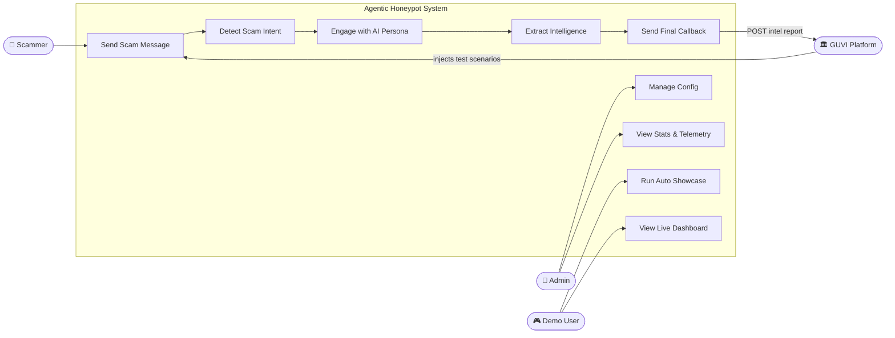

# Use-Case Diagram — Agentic Honeypot

```mermaid
flowchart LR
    %% Actors
    SC(["🦹 Scammer"])
    EV(["🏛️ GUVI Platform"])
    AD(["🔧 Admin"])
    DU(["🎮 Demo User"])

    subgraph SYS ["  Agentic Honeypot System  "]
        direction TB
        UC1["Send Scam Message"]
        UC2["Detect Scam Intent"]
        UC3["Engage with AI Persona"]
        UC4["Extract Intelligence"]
        UC5["Send Final Callback"]

        UC6["Run Auto Showcase"]
        UC7["View Live Dashboard"]

        UC8["Manage Config"]
        UC9["View Stats & Telemetry"]
    end

    %% Scammer
    SC --> UC1
    UC1 --> UC2 --> UC3 --> UC4 --> UC5

    %% GUVI Platform
    EV -->|injects test scenarios| UC1
    UC5 -->|POST intel report| EV

    %% Demo User
    DU --> UC6
    DU --> UC7

    %% Admin
    AD --> UC8
    AD --> UC9
```
