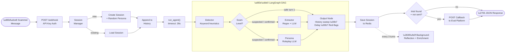

# Process Flow Diagram — Message Lifecycle

```mermaid
flowchart LR
    A(["\ud83d\udce8 Scammer\nMessage"]) --> B["POST /webhook\nAPI Key Auth"]
    B --> C["Session\nManager"]
    C -->|new| D["Create Session\n+ Random Persona"]
    C -->|existing| E["Load Session"]
    D & E --> F["Append to\nHistory"]

    F --> G["run_agent()\ntimeout: 28s"]

    subgraph LG [" \ud83e\udde0 LangGraph DAG "]
        direction TB
        G1["Detector\nKeyword heuristics"]
        G2{"Scam\nLevel?"}
        G3["Extractor\nRegex + LLM"]
        G4["Persona\nRoleplay LLM"]
        G5["Output Node\nHistory sweep \u00b7 Delay \u00b7 Red-flags"]
    end

    G --> G1 --> G2
    G2 -->|suspected / confirmed| G3 & G4
    G2 -->|safe turn-1| G5
    G3 & G4 --> G5

    G5 --> H["Save Session\nto Redis"]
    H --> I{"Intel found\n+ not sent?"}
    I -->|yes| J["POST Callback\nto Eval Platform"]
    I -->|no| K
    J --> K(["\u2705 JSON Response"])

    H -.->|every 3 turns| R["\u2699\ufe0f Background:\nReflection + Enrichment"]
```
