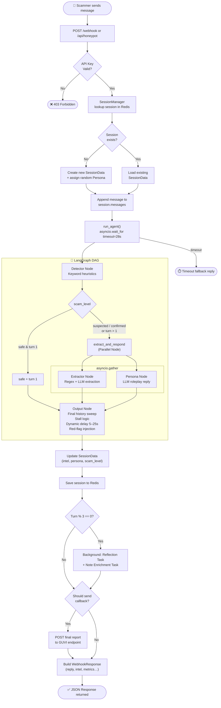

# Process Flow Diagram — Single Message Lifecycle

End-to-end flow of a single incoming scammer message through the system.

```mermaid
flowchart TD
    A(["📨 Scammer sends message"])
    B["POST /webhook or /api/honeypot"]
    C{"API Key\nValid?"}
    Z1(["❌ 403 Forbidden"])
    D["SessionManager\nlookup session in Redis"]
    E{"Session\nexists?"}
    F["Create new SessionData\n+ assign random Persona"]
    G["Load existing\nSessionData"]
    H["Append message to\nsession.messages"]
    I["run_agent()\nasyncio.wait_for timeout=28s"]

    subgraph LangGraph ["🧠 LangGraph DAG"]
        direction TB
        J["Detector Node\nKeyword heuristics"]
        K{"scam_level"}
        L["safe + turn 1"]
        P["extract_and_respond\n(Parallel Node)"]
        subgraph Parallel ["asyncio.gather"]
            direction LR
            M["Extractor Node\nRegex + LLM extraction"]
            N["Persona Node\nLLM roleplay reply"]
        end
        O["Output Node\nFinal history sweep\nStall logic\nDynamic delay 5–25s\nRed-flag injection"]
    end

    Q["Update SessionData\n(intel, persona, scam_level)"
    ]
    R["Save session to Redis"]
    S{"Turn % 3 == 0?"}
    T["Background: Reflection Task\n+ Note Enrichment Task"]
    U{"Should send\ncallback?"}
    V["POST final report\nto GUVI endpoint"]
    W["Build WebhookResponse\n(reply, intel, metrics…)"]
    X(["✅ JSON Response returned"])
    Y(["⏱️ Timeout fallback reply"])

    A --> B --> C
    C -- No --> Z1
    C -- Yes --> D --> E
    E -- No --> F --> H
    E -- Yes --> G --> H
    H --> I
    I -- timeout --> Y
    I --> J
    J --> K
    K -- "safe & turn 1" --> L --> O
    K -- "suspected / confirmed\nor turn > 1" --> P
    P --> M & N
    M & N --> O
    O --> Q --> R --> S
    S -- Yes --> T
    S -- No --> U
    T --> U
    U -- Yes --> V --> W
    U -- No --> W
    W --> X
```
