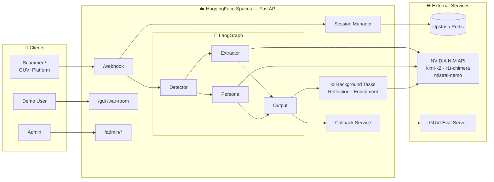

# Architecture Diagram — Agentic Honeypot

```mermaid
graph LR
    subgraph CL ["👥 Clients"]
        SC["Scammer /\nGUVI Platform"]
        AD["Admin"]
        DU["Demo User"]
    end

    subgraph APP ["☁️ HuggingFace Spaces — FastAPI"]
        WH["/webhook"]
        GUI["/gui  /war-room"]
        ADM["/admin/*"]

        subgraph LG ["🧠 LangGraph"]
            DET["Detector"]
            EXT["Extractor"]
            PER["Persona"]
            OUT["Output"]
        end

        SM["Session Manager"]
        CB["Callback Service"]
        BG["⚙️ Background Tasks\nReflection · Enrichment"]
    end

    subgraph EXT_SVC ["🌐 External Services"]
        REDIS[("Upstash Redis")]
        LLM["NVIDIA NIM API\nkimi-k2 · r1t-chimera\nmistral-nemo"]
        GUVI["GUVI Eval Server"]
    end

    SC --> WH
    AD --> ADM
    DU --> GUI

    WH --> SM --> REDIS
    WH --> DET --> EXT & PER --> OUT
    OUT --> CB --> GUVI
    OUT --> BG

    EXT & PER & BG --> LLM
```
