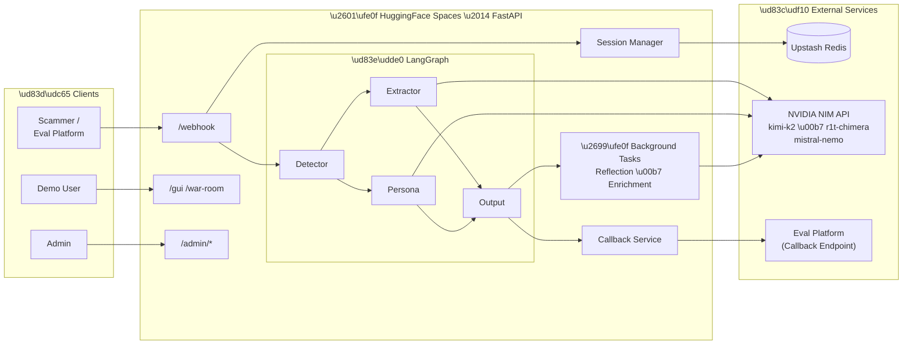

# Architecture Diagram — Agentic Honeypot

```mermaid
graph LR
    subgraph CL ["\ud83d\udc65 Clients"]
        SC["Scammer /\nEval Platform"]
        AD["Admin"]
        DU["Demo User"]
    end

    subgraph APP ["\u2601\ufe0f HuggingFace Spaces \u2014 FastAPI"]
        WH["/webhook"]
        GUI["/gui  /war-room"]
        ADM["/admin/*"]

        subgraph LG ["\ud83e\udde0 LangGraph"]
            DET["Detector"]
            EXT["Extractor"]
            PER["Persona"]
            OUT["Output"]
        end

        SM["Session Manager"]
        CB["Callback Service"]
        BG["\u2699\ufe0f Background Tasks\nReflection \u00b7 Enrichment"]
    end

    subgraph EXT_SVC ["\ud83c\udf10 External Services"]
        REDIS[("Upstash Redis")]
        LLM["NVIDIA NIM API\nkimi-k2 \u00b7 r1t-chimera\nmistral-nemo"]
        PLATFORM["Eval Platform\n(Callback Endpoint)"]
    end

    SC --> WH
    AD --> ADM
    DU --> GUI

    WH --> SM --> REDIS
    WH --> DET --> EXT & PER --> OUT
    OUT --> CB --> PLATFORM
    OUT --> BG

    EXT & PER & BG --> LLM
```
