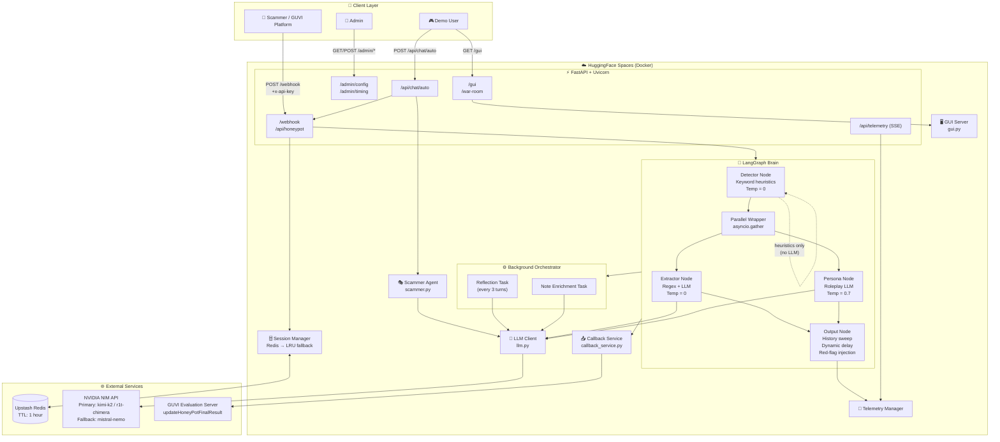

# Architecture Diagram — Agentic Honeypot System

Component-level view of all runtime services and their connections.

```mermaid
graph TB
    subgraph Clients ["👥 Client Layer"]
        SC["🦹 Scammer / GUVI Platform"]
        AD["🔧 Admin"]
        DU["🎮 Demo User"]
    end

    subgraph HF ["☁️ HuggingFace Spaces (Docker)"]
        direction TB

        subgraph API ["⚡ FastAPI + Uvicorn"]
            WH["/webhook\n/api/honeypot"]
            GUI_EP["/gui\n/war-room"]
            ADMIN_EP["/admin/config\n/admin/timing"]
            TELEMETRY_EP["/api/telemetry (SSE)"]
            AUTO_EP["/api/chat/auto"]
        end

        subgraph Brain ["🧠 LangGraph Brain"]
            DET["Detector Node\nKeyword heuristics\nTemp = 0"]
            PAR["Parallel Wrapper\nasyncio.gather"]
            EXT["Extractor Node\nRegex + LLM\nTemp = 0"]
            PER["Persona Node\nRoleplay LLM\nTemp = 0.7"]
            OUT["Output Node\nHistory sweep\nDynamic delay\nRed-flag injection"]
        end

        subgraph BG ["⚙️ Background Orchestrator"]
            REF["Reflection Task\n(every 3 turns)"]
            ENR["Note Enrichment Task"]
        end

        SM["🗄️ Session Manager\nRedis → LRU fallback"]
        LLM_C["🤖 LLM Client\nllm.py"]
        TEL["📡 Telemetry Manager"]
        SCAM_AGT["🎭 Scammer Agent\nscammer.py"]
        GUI_SRV["🖥️ GUI Server\ngui.py"]
        CB["📤 Callback Service\ncallback_service.py"]
    end

    subgraph External ["🌐 External Services"]
        REDIS[("Upstash Redis\nTTL: 1 hour")]
        NVIDIA["NVIDIA NIM API\nPrimary: kimi-k2 / r1t-chimera\nFallback: mistral-nemo"]
        GUVI["GUVI Evaluation Server\nupdateHoneyPotFinalResult"]
    end

    %% Client → API
    SC -- "POST /webhook\n+x-api-key" --> WH
    AD -- "GET/POST /admin/*" --> ADMIN_EP
    DU -- "GET /gui" --> GUI_EP
    DU -- "POST /api/chat/auto" --> AUTO_EP

    %% API → Brain
    WH --> Brain
    AUTO_EP --> SCAM_AGT
    SCAM_AGT --> LLM_C
    AUTO_EP --> WH

    %% Brain node flow
    DET --> PAR
    PAR --> EXT & PER
    EXT & PER --> OUT

    %% Brain → Services
    Brain --> BG
    Brain --> CB
    OUT --> TEL

    %% Services → External
    SM <--> REDIS
    LLM_C --> NVIDIA
    CB --> GUVI
    REF & ENR --> LLM_C

    %% API → Services
    WH --> SM
    TELEMETRY_EP --> TEL
    GUI_EP --> GUI_SRV

    %% LLM in Brain
    EXT --> LLM_C
    PER --> LLM_C
    DET -.->|"heuristics only\n(no LLM)"| DET
```
